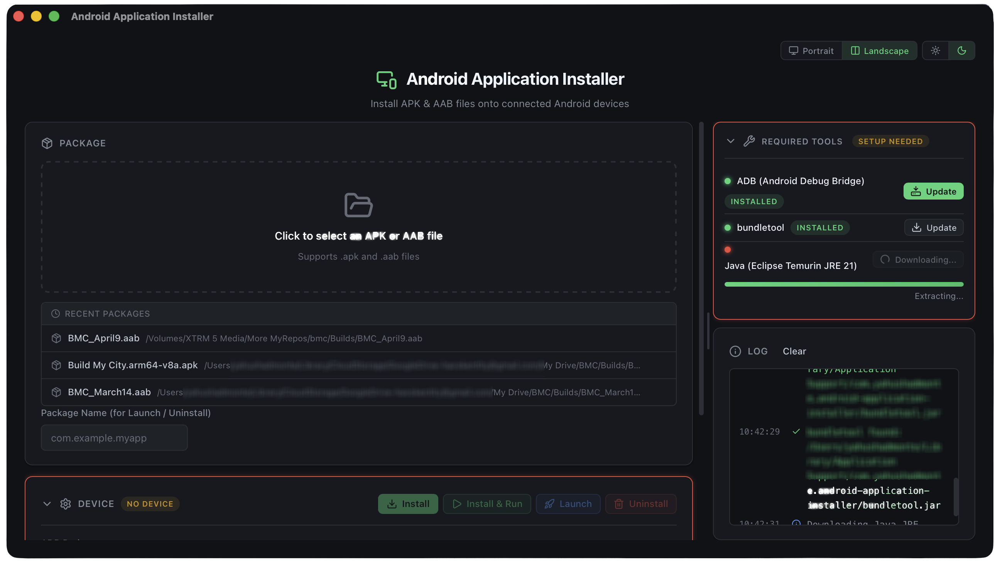
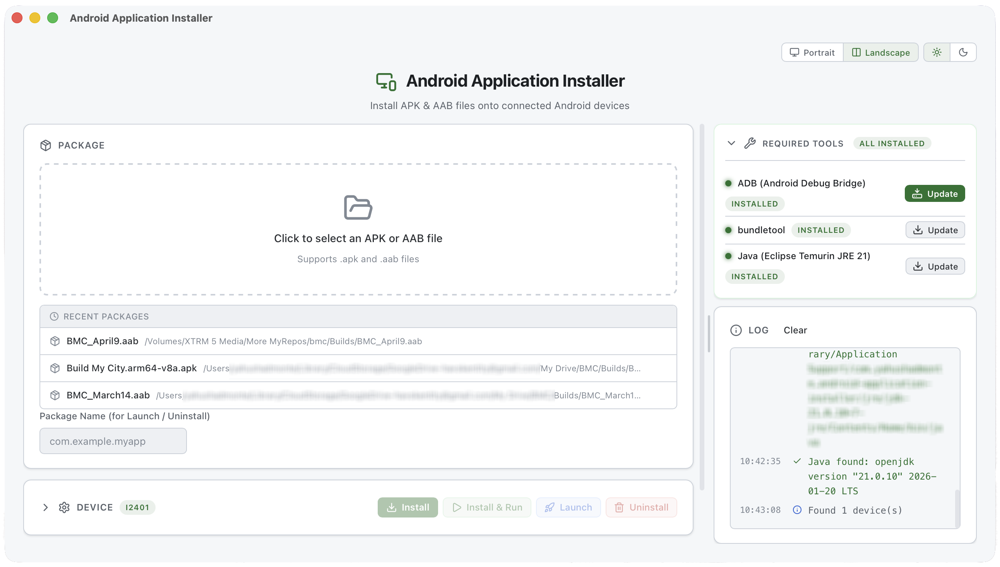
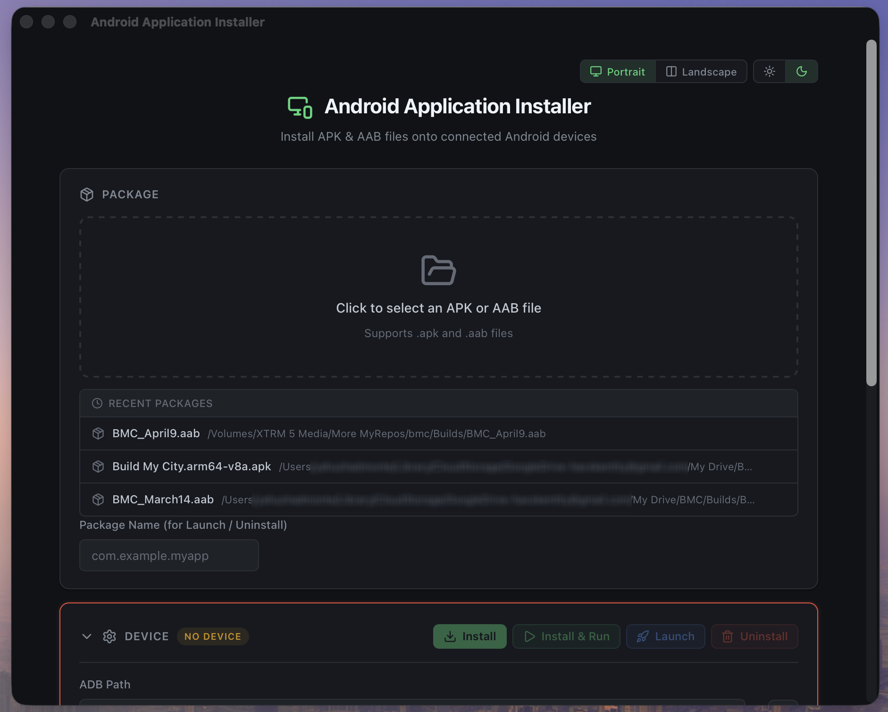

<div align="center">

# Android Application Installer

**Install APK & AAB files onto Android devices — no SDK required.**

[](https://github.com/havokentity/android-application-installer/actions/workflows/build.yml)
[](LICENSE)
[](https://tauri.app/)
[](https://react.dev/)
[](https://www.rust-lang.org/)
[](https://www.typescriptlang.org/)
[](#downloads)
[](#downloads)
[](#downloads)

</div>

---

## Screenshots

<p align="center">
  
</p>
<p align="center"><em>Landscape mode — dark theme</em></p>

<p align="center">
  
</p>
<p align="center"><em>Landscape mode — light theme</em></p>

<p align="center">
  
</p>
<p align="center"><em>Portrait mode — compact vertical layout</em></p>

---

## Features

### Core

- **APK installation** — install `.apk` files directly via ADB
- **AAB installation** — install `.aab` files via bundletool with optional keystore signing
- **Package management** — launch or uninstall apps by package name
- **Auto package name detection** — extracts the package name from APK and AAB files automatically

### Tools & Setup

- **Zero dependencies** — downloads ADB, bundletool, and Java JRE on demand (no Android SDK or system Java needed)
- **Update reminders** — notifies when managed tools are 30+ days old (never auto-downloads without consent)
- **Visual status indicators** — flashing red borders when tools are missing or no device is connected

### Interface

- **Drag & drop** — drag APK or AAB files from Finder / Explorer directly into the app
- **Keyboard shortcuts** — `Cmd/Ctrl+O` open file, `Cmd/Ctrl+I` install, `Cmd/Ctrl+Shift+I` install & run, `Cmd/Ctrl+L` launch, `Cmd/Ctrl+U` uninstall
- **Landscape & Portrait modes** — toggle between a wide two-panel layout and a compact vertical layout
- **Dark & Light themes** — switch themes with one click; preference is saved across sessions
- **Collapsible sections** — Device, Tools, and AAB Settings collapse when not needed, expand when they need attention
- **Draggable panel divider** — resize the log panel width in landscape mode; width is remembered
- **Smart auto-collapse** — Device section collapses once a device is connected, Tools section collapses once everything is installed
- **Inline action buttons** — Install, Launch, and Uninstall buttons live on the Device header, always accessible
- **Auto device refresh** — devices poll every 8 seconds and on window focus; new connections are detected automatically
- **Multi-device install** — install to all connected devices at once with a single checkbox
- **Log copy** — copy the full activity log to your clipboard for troubleshooting
- **Recent files** — quickly re-select recently used APK/AAB files and keystores
- **Version display** — app version shown in the header so you always know what build you're running
- **Dynamic title bar** — window title updates to show the currently selected filename

### Cross-Platform

- **macOS** — Apple Silicon (ARM64) and Intel (x64)
- **Windows** — installer (`.msi` / `-setup.exe`) and portable (`.exe`)
- **Linux** — `.deb` and `.AppImage`

---

## Downloads

Grab the latest release from the [**Releases page**](https://github.com/havokentity/android-application-installer/releases).

| Platform | Files |
|----------|-------|
| macOS (Apple Silicon) | `.dmg` |
| macOS (Intel) | `.dmg` |
| Windows (installer) | `.msi` or `-setup.exe` |
| Windows (portable) | `-portable.exe` — no install needed |
| Linux | `.deb` or `.AppImage` |

---

## Getting Started

### Prerequisites

- An Android device with **USB debugging** enabled
- A USB cable (or wireless ADB pairing)

> **For development only:**
> - [Node.js](https://nodejs.org/) >= 18
> - [Rust](https://rustup.rs/) (stable toolchain)

### Using a release build

1. Download from the [Releases page](https://github.com/havokentity/android-application-installer/releases)
2. Open the app
3. Click **Download ADB** when prompted
4. Connect your Android device via USB
5. Select an APK or AAB file and hit **Install**

### Building from source

```bash
# Install frontend dependencies
npm install

# Run in development mode
npm run tauri dev

# Build for production
npm run tauri build
```

Build artifacts output to `src-tauri/target/release/bundle/`.

---

## How It Works

### Managed Tools

The app downloads and manages its own tools — nothing is installed system-wide.

| Tool | Source | Purpose |
|------|--------|---------|
| **ADB** | [Google Platform-Tools](https://developer.android.com/tools/releases/platform-tools) | Communicate with Android devices |
| **bundletool** | [GitHub Releases](https://github.com/google/bundletool) | Convert `.aab` → `.apks` and install |
| **Java JRE 21** | [Eclipse Temurin](https://adoptium.net/) | Required to run bundletool |

### AAB Installation Flow

```
.aab file
   │
   ├─ bundletool build-apks ──→ device-specific .apks
   │                               │
   └─ bundletool install-apks ─────┘──→ installed on device
                                         │
                                    temp files cleaned up
```

Custom keystores are supported for signed builds — the app auto-detects key aliases from your keystore file.

### UI Layout

```
┌─────────────────────────────────────────────────────────────┐
│  [Portrait | Landscape]                      [☀ | ☾]       │
│                                                             │
│            Android Application Installer                    │
├──────────────────────────────────┬──────────────────────────┤
│                                  │  ▸ Required Tools        │
│  ┌ Package ────────────────────┐ │    ADB ● bundletool ●   │
│  │  Click to select APK / AAB  │ │    Java ●               │
│  └──────────────────────────────┘ │                          │
│                                  │  ┌ Log ────────────────┐ │
│  ▸ Device  [Pixel 8]            │  │ 12:00:01 ✓ ADB found│ │
│    [Install] [Install & Run]    │  │ 12:00:02 ℹ 1 device │ │
│    [Launch]  [Uninstall]        │  │ 12:00:05 ✓ Installed│ │
│                                  │  │                      │ │
│  ▸ AAB Settings                 │  └──────────────────────┘ │
│                                  │         ◂ drag ▸         │
└──────────────────────────────────┴──────────────────────────┘
```

---

## Project Structure

```
├── src/                          # React frontend
│   ├── App.tsx                   # Main application component
│   ├── App.css                   # Styles (dark/light themes, layouts)
│   ├── types.ts                  # Shared TypeScript interfaces
│   ├── helpers.ts                # Utility functions
│   ├── main.tsx                  # React entry point
│   └── components/
│       ├── LogPanel.tsx          # Activity log panel
│       ├── StatusIndicators.tsx  # StatusDot & LogIcon components
│       └── ToolsSection.tsx      # Tools setup + stale banner
│
├── src-tauri/                    # Rust backend (Tauri)
│   ├── src/
│   │   ├── main.rs              # App entry point
│   │   ├── lib.rs               # Tauri commands (ADB, install, launch, etc.)
│   │   └── tools.rs             # Managed tool downloads
│   ├── Cargo.toml               # Rust dependencies
│   ├── tauri.conf.json          # Tauri app configuration
│   └── capabilities/
│       └── default.json         # Tauri permissions
│
├── scripts/                      # Developer tooling
│   ├── bump-version.mjs          # Sync version across all config files
│   └── release.mjs               # Bump + commit + tag + push to trigger CI
│
├── docs/
│   └── architecture.md          # Technical architecture docs
│
├── .github/workflows/
│   └── build.yml                # CI: build & release for all platforms
│
├── index.html                   # HTML entry point
├── vite.config.ts               # Vite configuration
├── tsconfig.json                # TypeScript configuration
└── package.json                 # npm scripts & dependencies
```

---

## CI / CD

The GitHub Actions workflow builds for macOS (ARM64 + x64), Windows (x64), and Linux (x64).

**Automatic release** — use the release script:

```bash
npm run release:patch             # 1.1.2 → 1.1.3 + commit + tag + push
npm run release:minor             # 1.1.2 → 1.2.0
npm run release:major             # 1.1.2 → 2.0.0
npm run release -- 2.0.0          # set exact version
```

This bumps the version in all config files, commits, tags, and pushes — the tag triggers the CI build automatically.

**Manual tag** (without the script):

```bash
npm run version -- 1.2.0          # bump version files
git add -A && git commit -m "release: v1.2.0"
git tag v1.2.0
git push --tags
```

**Manual build** — trigger from the [Actions tab](https://github.com/havokentity/android-application-installer/actions) (artifacts downloadable without creating a release).

> **Version management:** The app version is stored in `package.json`, `src-tauri/tauri.conf.json`, and `src-tauri/Cargo.toml`. Use `npm run version` to check sync status. See [docs/architecture.md](docs/architecture.md) for full details.

---

## Tech Stack

| Layer | Technology |
|-------|-----------|
| Framework | [Tauri 2](https://tauri.app/) |
| Backend | Rust |
| Frontend | React 19 + TypeScript |
| Bundler | Vite |
| UI Icons | [Lucide React](https://lucide.dev/) |
| HTTP | reqwest (Rust) |
| Dialogs | tauri-plugin-dialog |

---

## License

[MIT](LICENSE)
